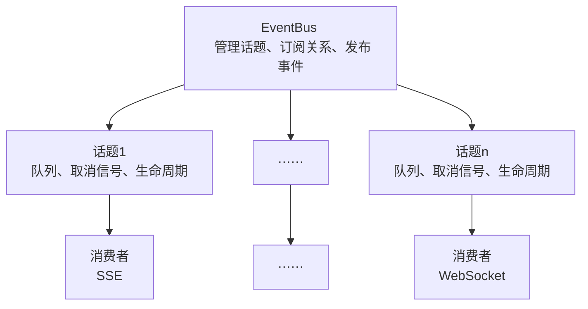

# xinshi
基础设施之事件总线

```mermaid
flowchart TD
    A["EventBus \n 管理话题、订阅关系、发布事件"]

    A --> B["话题1 \n 队列、取消信号、生命周期"]
    A --> C["······"]
    A --> D["话题n \n 队列、取消信号、生命周期"]

    B --> E["消费者 \n SSE"]
    C --> F["······"]
    D --> G["消费者 \n WebSocket"]
```

## 参考资料

- [feikong-teams:一个可本地运行的开源多智能体协作AI 助手](https://github.com/wsshow/feikong-teams)